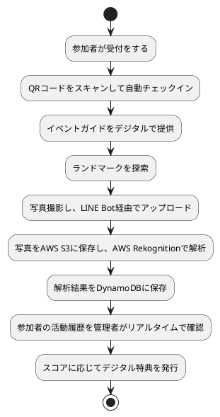
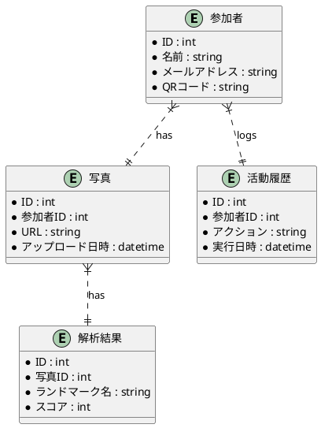

# 要件定義書

**プロジェクトタイトル:** こんこんプロジェクト  
**作成者:** [著者名、部署]  
**日付:** [日付を挿入]  
**バージョン:** 1.0  

## 目次
1. はじめに
2. システムの概要
3. 利害関係者
4. 現行業務の説明
5. システム要件
   - 機能要件
   - 非機能要件
6. インターフェース要件
7. データ要件
8. 制約事項
9. リスク管理
10. 変更管理
11. 付録

---

## 1. はじめに

### 目的
この要件定義書は、「こんこんプロジェクト」におけるシステム開発の目標、要件、制約などを明確にするために作成されました。本書は関係者間で共通の理解を持ち、システム開発を円滑に進めるための基本的な指針を提供します。

### 範囲
本プロジェクトは、イベント参加者が円滑にイベントに参加し、楽しむためのシステムを開発することを目的とします。具体的には、受付からイベントガイドの提供、写真撮影とアップロード、活動履歴の管理、特典の発行までのプロセスをシステム化します。

### 背景
イベント運営の効率化と参加者の利便性向上を目的とし、デジタル技術を活用したシステムの導入を決定しました。これにより、運営コストの削減や参加者の満足度向上を目指します。

### 用語定義
- **イベント**: ここでは、学校キャンパス内で行われるオリエンテーションやオープンキャンパスなどのイベントを指します。
- **参加者**: イベントに参加する学生や保護者。
- **オペレータ**: イベント運営を行うスタッフ。

---

## 2. システムの概要

### システムの説明
「こんこんプロジェクト」では、イベント運営をサポートするためのシステムを構築します。このシステムは、参加者の受付、イベントガイドの提供、ランドマークの探索、写真撮影と解析、活動履歴の管理、特典の発行といった機能を含みます。

### 目標
- **効率化**: 受付やガイド配布の自動化により、運営の効率を高める。
- **利便性向上**: 参加者が簡単に情報を取得し、イベントを楽しめるようにする。
- **データ活用**: 活動履歴を活用して、イベントの改善に役立てる。

---

## 3. 利害関係者

| 利害関係者       | 役割              | 利害関係              |
|------------------|------------------|---------------------|
| プロジェクトスポンサー | 資金提供者、最終決定者 | プロジェクトの成功と予算内運営 |
| プロジェクトマネージャー | 計画、実行、監視、コントロール | プロジェクトの時間内、予算内、品質基準の達成 |
| 開発チーム        | アプリケーション開発、テスト | 明確な要件定義、効果的なコミュニケーション |
| 運営スタッフ      | イベント運営、参加者サポート | アプリが参加者と運営スタッフのニーズを満たすこと |
| 参加者           | イベント参加者      | 楽しく有意義な体験 |
| 学校管理者        | 学校運営、イベント成功 | 学校の評判向上、新入生募集への貢献 |

---

## 4. 現行業務の説明

### 現行業務フロー
1. 参加者の受付
2. イベントガイドの配布と説明
3. ランドマークの探索
4. 写真撮影とアップロード
5. 参加者の活動履歴確認
6. 終了時の特典付与

### 問題点と改善点
- **受付の混雑**: QRコードによる自動チェックインで解消
- **イベントガイドの紛失**: デジタルガイドの提供で解消
- **写真撮影とアップロードの手間**: 自動画像認識技術で解消
- **活動履歴の手動確認の煩雑さ**: リアルタイムデータの自動収集と表示で解消
- **特典付与の際の混雑**: デジタル特典システムの導入で解消

### 新業務フロー


---

## 5. システム要件

### 5.1 機能要件

#### 5.1.1 機能一覧

| 管理番号 | 機能                     | 説明                                                    | 分類       | 対応業務要件 |
|----------|--------------------------|---------------------------------------------------------|------------|--------------|
| FR-1     | QRコードチェックイン     | QRコードを使用して参加者が自動チェックインを行う機能     | フロント機能 | BR-1         |
| FR-2     | デジタルガイド提供       | デジタルイベントガイドをLINE Bot内で提供する機能        | フロント機能 | BR-2         |
| FR-3     | ランドマーク探索         | デジタルガイドに従ってランドマークを探索する機能        | UI         | BR-3         |
| FR-4     | 写真撮影とアップロード   | 参加者が撮影した写真をLINE Botを通じて自動でアップロードし、解析する機能 | バック機能 | BR-4         |
| FR-5     | 活動履歴のリアルタイム管理 | 参加者の活動履歴をリアルタイムで収集・管理する機能      | バック機能 | BR-5         |
| FR-6     | デジタル特典発行         | スコアに応じたデジタル特典を自動で発行し、参加者に配布する機能 | バック機能 | BR-6         |
| FR-7     | データ確認               | オペレータが参加者の活動履歴を確認する機能              | UI         | BR-5         |

#### 5.1.2 ユースケース

1. **QRコードチェックイン**
   - **アクター**: 参加者、LINE Bot
   - **前提条件**: 参加者がイベント会場に到着し、QRコードをスキャンできる環境がある。
   - **基本フロー**: 
     1. 参加者がQRコードをスキャンする。
     2. LINE Botがチェックインを確認し、参加者にイベント情報を提供。
   - **代替フロー**: QRコードが読み取れない場合、手動でのチェックイン手続きを行う。
   - **成功条件**: 参加者が正常にチェックインし、イベント情報を受け取る。

2. **デジタルガイド提供**
   - **アクター**: 参加者、LINE Bot
   - **前提条件**: 参加者がLINE Botと友達追加している。
   - **基本フロー**: 
     1. 参加者がイベントガイドを要求する。
     2. LINE Botがデジタルガイドを提供。
   - **代替フロー**: LINE Botが応答しない場合、ウェブサイトからガイドをダウンロードする。
   - **成功条件**: 参加者がイベントガイドを正常に受け取る。

#### 5.1.3 画面遷移図
```plantuml
@startuml
[ホーム画面] --> [QRコードチェックイン画面]
[ホーム画面

] --> [デジタルガイド画面]
[ホーム画面] --> [写真撮影画面]
[ホーム画面] --> [特典画面]
@enduml
```

#### 5.1.4 プロトタイプ
- **QRコードチェックイン画面**: QRコードをスキャンするためのシンプルな画面。
- **デジタルガイド画面**: イベント情報やランドマークの地図を表示する画面。
- **写真撮影画面**: カメラ機能を持ち、撮影後に写真をアップロードできる画面。
- **特典画面**: 取得した特典を表示し、利用できる画面。

### 5.2 非機能要件

#### 5.2.1 非機能要件一覧表

| 非機能要件               | 管理番号 | 個別定義対象 | 内容                                                                                   |
|--------------------------|----------|--------------|----------------------------------------------------------------------------------------|
| 可用性                   | NFR-1    | ○            | システムはイベント開催中に常時稼働し、ダウンタイムが発生しないようにする。AWSのマルチAZ構成を採用 |
| 性能                     | NFR-2    | ○            | 画像解析結果のレスポンス時間を2秒以内に抑える。1000人以上の同時アクセスにも対応         |
| セキュリティ             | NFR-3    | ○            | 全てのデータ通信はHTTPSを使用し、AWS IAMで厳格なアクセス制御を行う。個人情報の暗号化とセキュリティ監査 |
| 移行性                   | NFR-4    | ○            | 他のイベントやシステムへの移行が容易に行えるよう、設定ファイルとドキュメントを整備し、APIを使用 |
| プロジェクト上の留意事項 | NFR-5    | ○            | 開発スケジュールを遵守するため、アジャイル開発手法を採用し、1ヶ月ごとのスプリントで進捗を管理 |
| 拡張性                   | NFR-6    | ○            | 将来的な機能追加や変更に対応できるよう、モジュール化された設計を採用し、コードの変更が容易に行える |
| 保守性                   | NFR-7    | ○            | システムの保守とアップデートが容易に行えるよう、ドキュメントとテストコードを整備           |
| ユーザビリティ           | NFR-8    | ○            | 参加者やオペレータが直感的に操作できるユーザーインターフェースを提供                      |
| 対応性                   | NFR-9    | ○            | 多言語対応を実施し、障害発生時の対応マニュアルを整備して迅速なサポートを提供                |

#### 5.2.2 非機能要件詳細

1. **可用性**
   - **管理番号**: NFR-1
   - **個別定義対象**: ○
   - **内容**: システムはイベント開催中に常時稼働し、ダウンタイムが発生しないようにする。AWSのマルチAZ構成を採用し、高可用性を確保する。

2. **性能**
   - **管理番号**: NFR-2
   - **個別定義対象**: ○
   - **内容**: 画像解析結果のレスポンス時間を2秒以内に抑える。1000人以上の同時アクセスにも対応できるスケーラビリティを持つ。

3. **セキュリティ**
   - **管理番号**: NFR-3
   - **個別定義対象**: ○
   - **内容**: 全てのデータ通信はHTTPSを使用し、AWS IAMで厳格なアクセス制御を行う。個人情報の暗号化と、定期的なセキュリティ監査を実施。

4. **移行性**
   - **管理番号**: NFR-4
   - **個別定義対象**: ○
   - **内容**: 他のイベントやシステムへの移行が容易に行えるよう、設定ファイルとドキュメントを整備し、標準化されたAPIを使用する。

5. **プロジェクト上の留意事項**
   - **管理番号**: NFR-5
   - **個別定義対象**: ○
   - **内容**: 開発スケジュールを遵守するために、アジャイル開発手法を採用し、1ヶ月ごとのスプリントで進捗を管理する。予算内での開発を確実にするために、定期的なコストレビューを実施。

6. **拡張性**
   - **管理番号**: NFR-6
   - **個別定義対象**: ○
   - **内容**: 将来的な機能追加や変更に対応できるよう、モジュール化された設計を採用し、コードの変更が容易に行えるようにする。

7. **保守性**
   - **管理番号**: NFR-7
   - **個別定義対象**: ○
   - **内容**: システムの保守とアップデートが容易に行えるよう、ドキュメントとテストコードを整備する。自動テストとCI/CDパイプラインを導入し、デプロイメントを迅速に行う。

8. **ユーザビリティ**
   - **管理番号**: NFR-8
   - **個別定義対象**: ○
   - **内容**: 参加者やオペレータが直感的に操作できるユーザーインターフェースを提供し、UX/UIのテストを通じて使いやすさを検証する。

9. **対応性**
   - **管理番号**: NFR-9
   - **個別定義対象**: ○
   - **内容**: 多言語対応を実施し、日本語以外の言語でも使用可能にする。また、障害発生時の対応マニュアルを整備し、迅速なサポートを提供する。

---

## 6. インターフェース要件

### 6.1 ユーザーインターフェース
- **QRコードチェックイン画面**: 参加者がQRコードをスキャンして自動チェックインを行う画面。
- **デジタルイベントガイド画面**: イベント情報やランドマーク情報を提供する画面。
- **写真撮影画面**: 参加者が写真を撮影し、LINE Bot経由でアップロードする画面。
- **管理者ダッシュボード**: オペレータが参加者の活動履歴をリアルタイムで確認するための画面。

### 6.2 外部インターフェース
- **LINE Bot**: 参加者がQRコードをスキャンして友達追加し、イベント情報や写真アップロードを行うためのインターフェース。
- **AWS S3**: 写真データの保存場所。
- **AWS Rekognition**: 写真データの解析を行うサービス。
- **AWS DynamoDB**: 解析結果や活動履歴データの保存場所。
- **AWS Lambda**: イベント駆動型のバックエンド処理を行うためのサービス。

---

## 7. データ要件

### 7.1 データモデル


### 7.2 データフロー図
```plantuml
@startuml
participant 参加者
participant LINE Bot
participant AWS S3
participant AWS Rekognition
participant AWS DynamoDB
participant AWS Lambda

参加者 -> LINE Bot: QRコードスキャン
LINE Bot -> AWS Lambda: チェックインデータ送信
AWS Lambda -> AWS DynamoDB: データ保存

参加者 -> LINE Bot

: 写真アップロード
LINE Bot -> AWS S3: 写真保存
AWS S3 -> AWS Lambda: 新写真トリガー
AWS Lambda -> AWS Rekognition: 画像解析依頼
AWS Rekognition -> AWS Lambda: 解析結果送信
AWS Lambda -> AWS DynamoDB: 結果保存

参加者 -> LINE Bot: 活動
LINE Bot -> AWS Lambda: 活動データ送信
AWS Lambda -> AWS DynamoDB: データ保存

AWS DynamoDB -> 管理者: 活動履歴表示
@enduml
```

### 7.3 データベース設計
- **テーブル定義**
  - **参加者**: ID (PK), 名前, メールアドレス, QRコード
  - **写真**: ID (PK), 参加者ID (FK), URL, アップロード日時
  - **解析結果**: ID (PK), 写真ID (FK), ランドマーク名, スコア
  - **活動履歴**: ID (PK), 参加者ID (FK), アクション, 実行日時

- **インデックス**
  - **写真**テーブル: 参加者IDインデックス
  - **解析結果**テーブル: 写真IDインデックス
  - **活動履歴**テーブル: 参加者IDインデックス

- **制約条件**
  - 外部キー制約: 写真テーブルの参加者IDは参加者テーブルのIDを参照
  - 外部キー制約: 解析結果テーブルの写真IDは写真テーブルのIDを参照
  - 外部キー制約: 活動履歴テーブルの参加者IDは参加者テーブルのIDを参照

---

## 8. 制約事項

### 8.1 技術的制約
- **使用技術**: AWSを中心としたクラウドインフラを利用すること。
- **開発言語**: Pythonを使用すること。

### 8.2 予算制約
- **開発コスト**: 500万円以内に抑える。
- **維持・運営コスト**: 月間10万円以内。

### 8.3 スケジュール制約
- **初回リリース**: 2024年9月30日までに完了。
- **バグフィックスと機能追加のスプリント**: 1ヶ月ごとに1回。

---

## 9. リスク管理

### 9.1 リスク一覧

| リスク               | 対策                                     |
|----------------------|------------------------------------------|
| 開発遅延             | スケジュールの定期レビュー、進捗報告の強化 |
| 予算超過             | コスト監視、優先度の高い機能への集中       |
| 技術的障害           | 技術検証、バックアップ計画の準備         |
| ユーザー不満         | ユーザーテスト、フィードバックの収集と反映 |

### 9.2 リスク対策
- **開発遅延**: スケジュールの定期レビュー、進捗報告の強化
- **予算超過**: コスト監視、優先度の高い機能への集中
- **技術的障害**: 技術検証、バックアップ計画の準備
- **ユーザー不満**: ユーザーテスト、フィードバックの収集と反映

---

## 10. 変更管理

### 10.1 変更管理プロセス
1. 変更要求の提出: 利害関係者が変更要求を提出します。
2. 変更要求の評価: プロジェクトマネージャーが変更要求を評価し、影響を分析します。
3. 変更要求の承認: 評価結果を基に、変更要求を承認または拒否します。
4. 変更の実施: 承認された変更を実施し、システムに反映します。
5. 変更履歴の更新: 変更内容を記録し、変更履歴を更新します。

### 10.2 変更履歴

| 変更日   | 変更内容         | 変更理由                  | 変更者       |
|----------|------------------|---------------------------|--------------|
| YYYY/MM/DD | 初版作成         | 初回作成                   | 著者名       |
| YYYY/MM/DD | 非機能要件追加   | 要件漏れの修正             | 著者名       |
| YYYY/MM/DD | ユースケース修正 | 利害関係者からのフィードバック | 著者名       |

---

## 11. 付録

### 11.1 参照資料
- プロジェクト計画書
- 事前調査レポート
- 技術仕様書

### 11.2 用語集
- **QRコード**: Quick Responseコード。高速読み取りが可能な2次元バーコード。
- **AWS**: Amazon Web Services。クラウドコンピューティングサービス。
- **S3**: Simple Storage Service。AWSのストレージサービス。
- **Rekognition**: AWSの画像解析サービス。
- **DynamoDB**: AWSのNoSQLデータベースサービス。
- **Lambda**: AWSのサーバーレスコンピューティングサービス。
- **LINE Bot**: LINE Messaging APIを使用して構築されるチャットボット。ユーザーと自動的に対話し、メッセージの送受信や特定のアクションを実行する。
