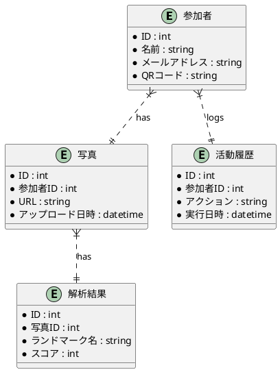

### 技術仕様書

---

#### 技術仕様書

**プロジェクト名:** こんこんプロジェクト  
**作成者:** [著者名、部署]  
**日付:** [日付を挿入]  
**バージョン:** 1.0  

---

#### 1. システム概要

**システムの説明:**  
「こんこんプロジェクト」では、イベント運営をサポートするためのシステムを構築します。このシステムは、参加者の受付、イベントガイドの提供、ランドマークの探索、写真撮影と解析、活動履歴

の管理、特典の発行といった機能を含みます。

---

#### 2. 要件仕様

**機能要件:**  
- QRコードチェックインシステム（QRコードは人手で生成）
- デジタルイベントガイド提供システム
- 写真撮影と解析システム
- 活動履歴管理システム
- デジタル特典発行システム

**非機能要件:**  
- 可用性: システムはイベント開催中に常時稼働し、ダウンタイムが発生しないようにする。
- 性能: 画像解析結果のレスポンス時間を2秒以内に抑える。
- セキュリティ: 全てのデータ通信はHTTPSを使用し、AWS IAMで厳格なアクセス制御を行う。
- 移行性: 他のイベントやシステムへの移行が容易に行えるよう、設定ファイルとドキュメントを整備する。
- 拡張性: モジュール化された設計を採用し、コードの変更が容易に行えるようにする。
- 保守性: ドキュメントとテストコードを整備し、自動テストとCI/CDパイプラインを導入する。
- ユーザビリティ: 参加者やオペレータが直感的に操作できるユーザーインターフェースを提供する。
- 対応性: 多言語対応を実施し、迅速なサポートを提供する。

---

#### 3. システムアーキテクチャ

**システム構成図:**  
```plantuml
@startuml
participant 参加者
participant LINE Bot
participant AWS S3
participant AWS Rekognition
participant AWS DynamoDB
participant AWS Lambda

参加者 -> LINE Bot: QRコードスキャン
LINE Bot -> AWS Lambda: チェックインデータ送信
AWS Lambda -> AWS DynamoDB: データ保存

参加者 -> LINE Bot: 写真アップロード
LINE Bot -> AWS S3: 写真保存
AWS S3 -> AWS Lambda: 新写真トリガー
AWS Lambda -> AWS Rekognition: 画像解析依頼
AWS Rekognition -> AWS Lambda: 解析結果送信
AWS Lambda -> AWS DynamoDB: 結果保存

参加者 -> LINE Bot: 活動
LINE Bot -> AWS Lambda: 活動データ送信
AWS Lambda -> AWS DynamoDB: データ保存

AWS DynamoDB -> 管理者: 活動履歴表示
@enduml
```

**技術スタック:**  
- 開発言語: Python
- フレームワーク: Flask
- クラウドインフラ: AWS（S3, Rekognition, DynamoDB, Lambda）
- 外部インターフェース: LINE Messaging API

---

#### 4. データ設計

**データモデル:**  


**データフロー図:**  
（前述のシステム構成図を参照）

**データベース設計:**  
- **テーブル定義**
  - **参加者**: ID (PK), 名前, メールアドレス, QRコード
  - **写真**: ID (PK), 参加者ID (FK), URL, アップロード日時
  - **解析結果**: ID (PK), 写真ID (FK), ランドマーク名, スコア
  - **活動履歴**: ID (PK), 参加者ID (FK), アクション, 実行日時

- **インデックス**
  - **写真**テーブル: 参加者IDインデックス
  - **解析結果**テーブル: 写真IDインデックス
  - **活動履歴**テーブル: 参加者IDインデックス

- **制約条件**
  - 外部キー制約: 写真テーブルの参加者IDは参加者テーブルのIDを参照
  - 外部キー制約: 解析結果テーブルの写真IDは写真テーブルのIDを参照
  - 外部キー制約: 活動履歴テーブルの参加者IDは参加者テーブルのIDを参照

---

#### 5. インターフェース仕様

**ユーザーインターフェース:**  
- **QRコードチェックイン画面**: 参加者がQRコードをスキャンして自動チェックインを行う画面。
- **デジタルイベントガイド画面**: イベント情報やランドマーク情報を提供する画面。
- **写真撮影画面**: 参加者が写真を撮影し、LINE Bot経由でアップロードする画面。
- **管理者ダッシュボード**: オペレータが参加者の活動履歴をリアルタイムで確認するための画面。

**外部インターフェース:**  
- **LINE Bot**: 参加者がQRコードをスキャンして友達追加し、イベント情報や写真アップロードを行うためのインターフェース。
- **AWS S3**: 写真データの保存場所。
- **AWS Rekognition**: 写真データの解析を行うサービス。
- **AWS DynamoDB**: 解析結果や活動履歴データの保存場所。
- **AWS Lambda**: イベント駆動型のバックエンド処理を行うためのサービス。

---

#### 6. セキュリティ設計

**セキュリティ要件:**  
- **認証:** QRコードを使用したシングルサインオン
- **認可:** AWS IAMを利用したアクセス制御
- **データ暗号化:** データの保存と通信時の暗号化（HTTPS、KMS）

**脅威モデリング:**  
- **脅威:** データ漏洩、なりすまし攻撃
- **対策:** IAMポリシーの厳格化、定期的なセキュリティ監査、ログの監視

---

#### 7. テスト計画

**テスト戦略:**  
- **ユニットテスト:** 各機能の単体テスト
- **統合テスト:** 複数機能の組み合わせテスト
- **システムテスト:** システム全体のテスト
- **ユーザビリティテスト:** ユーザーインターフェースの使いやすさを評価

**テストケース:**  
- **QRコードチェックイン:** 正常なQRコードスキャン、無効なQRコードの処理
- **デジタルガイド提供:** 正常なガイド提供、ガイドの更新処理
- **写真撮影とアップロード:** 写真の正常アップロード、解析エラーの処理
- **活動履歴の管理:** 活動履歴の正常表示、履歴データの更新処理
- **デジタル特典発行:** 特典の正常発行、特典使用の管理

---

#### 8. 運用と保守

**運用計画:**  
- **モニタリング:** システムのパフォーマンスと稼働状況の監視（CloudWatch）
- **バックアップ:** 定期的なデータバックアップとリストア手順
- **障害対応:** 障害発生時の対応手順と連絡体制

**保守計画:**  
- **アップデート:** システムの定期的なアップデートとパッチ適用
- **ドキュメント:** 技術文書と運用ガイドの整備
- **サポート:** ユーザーからの問い合わせ対応とフィードバックの反映

---
