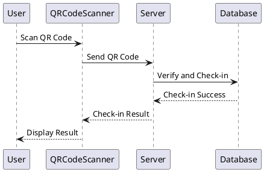
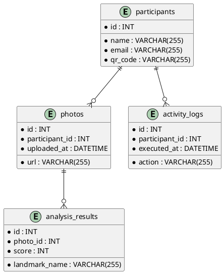
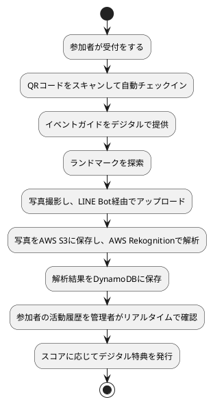
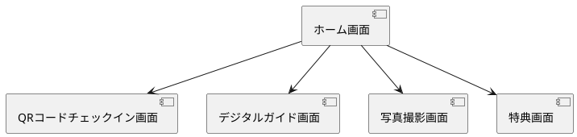
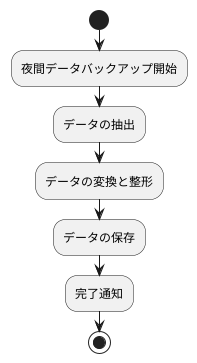
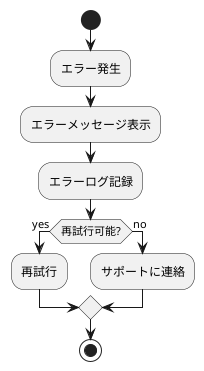
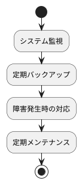

# 詳細設計書

## 1. 表紙
- **ドキュメントタイトル**: こんこんプロジェクト詳細設計書
- **作成日**: [日付を挿入]
- **作成者**: [著者名、部署]
- **版数**: 1.0

## 2. 目次
1. [表紙](#1-表紙)
2. [目次](#2-目次)
3. [概要](#3-概要)
4. [システム構成](#4-システム構成)
5. [プログラム設計](#5-プログラム設計)
6. [クラス設計](#6-クラス設計)
7. [メソッド設計](#7-メソッド設計)
8. [モジュール設計](#8-モジュール設計)
9. [データベース設計](#9-データベース設計)
10. [詳細なプログラム仕様](#10-詳細なプログラム仕様)
11. [詳細な画面設計](#11-詳細な画面設計)
12. [詳細な帳票設計](#12-詳細な帳票設計)
13. [外部インターフェース設計](#13-外部インターフェース設計)
14. [バッチ処理設計](#14-バッチ処理設計)
15. [ユニットテスト設計](#15-ユニットテスト設計)
16. [セキュリティ設計](#16-セキュリティ設計)
17. [エラーハンドリング設計](#17-エラーハンドリング設計)
18. [パフォーマンス設計](#18-パフォーマンス設計)
19. [環境設定](#19-環境設定)
20. [運用設計](#20-運用設計)
21. [保守設計](#21-保守設計)
22. [変更管理](#22-変更管理)
23. [付録](#23-付録)

## 3. 概要
### システム概要
「こんこんプロジェクト」は、イベント参加者が円滑にイベントに参加し楽しむためのシステムを構築します。参加者の受付、イベントガイドの提供、写真撮影とアップロード、活動履歴の管理、特典の発行を含みます。

### 対象範囲
本プロジェクトは学校キャンパス内で行われるオリエンテーションやオープンキャンパスなどのイベントを対象とします。

### 用語定義
- **イベント**: 学校キャンパス内で行われるオリエンテーションやオープンキャンパス。
- **参加者**: イベントに参加する学生や保護者。
- **オペレータ**: イベント運営を行うスタッフ。

## 4. システム構成
### システム全体の構成図


### 各コンポーネントの配置図
- **LINE Bot**: 参加者とインターフェース
- **AWS S3**: 画像保存
- **AWS Rekognition**: 画像解析
- **AWS DynamoDB**: データ保存
- **AWS Lambda**: イベント駆動型バックエンド処理

## 5. プログラム設計
### プログラム一覧
| プログラムID | プログラム名                 | 概要                                              |
|--------------|------------------------------|---------------------------------------------------|
| PR-1         | QRコードチェックイン         | QRコードを使用して参加者が自動チェックインを行う機能 |
| PR-2         | デジタルガイド提供           | デジタルイベントガイドをLINE Bot内で提供する機能    |
| PR-3         | 写真アップロードと解析       | 写真のアップロードとAWS Rekognitionでの解析        |
| PR-4         | 活動履歴管理                 | 活動履歴のリアルタイム収集と管理                    |
| PR-5         | デジタル特典発行             | スコアに応じたデジタル特典の発行                    |

### 各プログラムの目的と概要
- **PR-1 QRコードチェックイン**: 参加者がQRコードをスキャンしてチェックインするためのプログラム。
- **PR-2 デジタルガイド提供**: LINE Botを通じてイベントガイドを提供するプログラム。
- **PR-3 写真アップロードと解析**: 参加者が撮影した写真をLINE Bot経由でアップロードし、AWS Rekognitionで解析するプログラム。
- **PR-4 活動履歴管理**: 参加者の活動履歴をリアルタイムで収集し、管理者が確認できるようにするプログラム。
- **PR-5 デジタル特典発行**: 参加者のスコアに基づいてデジタル特典を発行するプログラム。

### プログラム間の関係
- **PR-1**と**PR-2**は参加者のチェックインとガイド提供を担当。
- **PR-3**は参加者が撮影した写真を解析。
- **PR-4**は全ての活動履歴を収集し、管理。
- **PR-5**は参加者のスコアに基づいて特典を発行。

## 6. クラス設計

### クラス定義

#### 参加者クラス (`Participant`)
**目的**: イベント参加者の情報を管理する。

| 属性名       | データ型    | 説明                   |
|--------------|-------------|------------------------|
| `id`         | `int`       | 参加者の一意の識別子   |
| `name`       | `string`    | 参加者の名前           |
| `email`      | `string`    | 参加者のメールアドレス |
| `qr_code`    | `string`    | QRコード               |

**メソッド**:

- `__init__(self, id: int, name: string, email: string, qr_code: string)`: 初期化メソッド
- `get_details(self) -> dict`: 参加者の詳細情報を取得
- `update_email(self, new_email: string)`: メールアドレスを更新

```python
class Participant:
    def __init__(self, id: int, name: str, email: str, qr_code: str):
        self.id = id
        self.name = name
        self.email = email
        self.qr_code = qr_code

    def get_details(self) -> dict:
        return {
            "id": self.id,
            "name": self.name,
            "email": self.email,
            "qr_code": self.qr_code
        }

    def update_email(self, new_email: str):
        self.email = new_email
```

#### 写真クラス (`Photo`)
**目的**: 参加者がアップロードする写真を管理する。

| 属性名       | データ型    | 説明                   |
|--------------|-------------|------------------------|
| `id`         | `int`       | 写真の一意の識別子     |
| `participant_id` | `int`   | 参加者の識別子         |
| `url`        | `string`    | 写真のURL             |
| `uploaded_at` | `datetime` | アップロード日時       |

**メソッド**:

- `__init__(self, id: int, participant_id: int, url: str, uploaded_at: datetime)`: 初期化メソッド
- `get_photo_info(self) -> dict`: 写真の詳細情報を取得

```python
class Photo:
    def __init__(self, id: int, participant_id: int, url: str, uploaded_at: datetime):
        self.id = id
        self.participant_id = participant_id
        self.url = url
        self.uploaded_at = uploaded_at

    def get_photo_info(self) -> dict:
        return {
            "id": self.id,
            "participant_id": self.participant_id,
            "url": self.url,
            "uploaded_at": self.uploaded_at
        }
```

#### 解析結果クラス (`AnalysisResult`)
**目的**: 写真の解析結果を管理する。

| 属性名       | データ型    | 説明                   |
|--------------|-------------|------------------------|
| `id`         | `int`       | 解析結果の一意の識別子 |
| `photo_id`   | `int`      

 | 写真の識別子           |
| `landmark_name` | `string` | ランドマーク名         |
| `score`      | `int`       | スコア                 |

**メソッド**:

- `__init__(self, id: int, photo_id: int, landmark_name: str, score: int)`: 初期化メソッド
- `get_analysis_info(self) -> dict`: 解析結果の詳細情報を取得

```python
class AnalysisResult:
    def __init__(self, id: int, photo_id: int, landmark_name: str, score: int):
        self.id = id
        self.photo_id = photo_id
        self.landmark_name = landmark_name
        self.score = score

    def get_analysis_info(self) -> dict:
        return {
            "id": self.id,
            "photo_id": self.photo_id,
            "landmark_name": self.landmark_name,
            "score": self.score
        }
```

#### 活動履歴クラス (`ActivityLog`)
**目的**: 参加者の活動履歴を管理する。

| 属性名       | データ型    | 説明                   |
|--------------|-------------|------------------------|
| `id`         | `int`       | 活動履歴の一意の識別子 |
| `participant_id` | `int`   | 参加者の識別子         |
| `action`     | `string`    | 実行したアクション     |
| `executed_at` | `datetime` | 実行日時               |

**メソッド**:

- `__init__(self, id: int, participant_id: int, action: str, executed_at: datetime)`: 初期化メソッド
- `get_log_info(self) -> dict`: 活動履歴の詳細情報を取得

```python
class ActivityLog:
    def __init__(self, id: int, participant_id: int, action: str, executed_at: datetime):
        self.id = id
        self.participant_id = participant_id
        self.action = action
        self.executed_at = executed_at

    def get_log_info(self) -> dict:
        return {
            "id": self.id,
            "participant_id": self.participant_id,
            "action": self.action,
            "executed_at": self.executed_at
        }
```

## 7. メソッド設計

### メソッド仕様書

#### `checkIn` メソッド
**目的**: QRコードをスキャンして参加者をイベントにチェックインさせる。

**引数**:
- `qr_code: string` - チェックインに使用するQRコード

**戻り値**:
- `result: bool` - チェックインが成功したかどうかを示す真偽値

**ロジック**:
1. QRコードをデコードして参加者IDを取得する。
2. 参加者IDを用いてデータベースにチェックイン情報を保存する。
3. チェックイン成功の結果を返す。

**エラー処理**:
- QRコードが無効な場合、例外をスローしてエラーメッセージを返す。
- データベース接続エラーの場合、例外をスローしてエラーメッセージを返す。

**サンプルコード**:
```python
def checkIn(qr_code: str) -> bool:
    try:
        participant_id = decodeQRCode(qr_code)
        saveCheckInToDatabase(participant_id)
        logging.info(f'Check-in successful for participant ID: {participant_id}')
        return True
    except InvalidQRCodeError:
        logging.error('Invalid QR Code')
        return False
    except DatabaseError:
        logging.error('Database connection error')
        return False
```

#### `provideGuide` メソッド
**目的**: 参加者にデジタルイベントガイドを提供する。

**引数**:
- `participant_id: int` - イベント参加者のID

**戻り値**:
- `guide_data: dict` - イベントガイドのデータ

**ロジック**:
1. 参加者IDに基づいてデジタルガイド情報をデータベースから取得する。
2. ガイド情報を返す。

**エラー処理**:
- 参加者IDが無効な場合、例外をスローしてエラーメッセージを返す。
- データベース接続エラーの場合、例外をスローしてエラーメッセージを返す。

**サンプルコード**:
```python
def provideGuide(participant_id: int) -> dict:
    try:
        guide_data = fetchGuideFromDatabase(participant_id)
        return guide_data
    except InvalidParticipantIdError:
        logging.error('Invalid participant ID')
        return None
    except DatabaseError:
        logging.error('Database connection error')
        return None
```

#### `uploadPhoto` メソッド
**目的**: 参加者が撮影した写真をS3にアップロードする。

**引数**:
- `participant_id: int` - イベント参加者のID
- `photo: bytes` - アップロードする写真データ

**戻り値**:
- `upload_url: str` - アップロードされた写真のURL

**ロジック**:
1. 写真データをS3にアップロードする。
2. アップロードされた写真のURLを返す。

**エラー処理**:
- S3アップロードエラーの場合、例外をスローしてエラーメッセージを返す。
- データベース接続エラーの場合、例外をスローしてエラーメッセージを返す。

**サンプルコード**:
```python
def uploadPhoto(participant_id: int, photo: bytes) -> str:
    try:
        upload_url = uploadToS3(photo)
        savePhotoUrlToDatabase(participant_id, upload_url)
        logging.info(f'Photo uploaded for participant ID: {participant_id}, URL: {upload_url}')
        return upload_url
    except S3UploadError:
        logging.error('S3 upload error')
        return None
    except DatabaseError:
        logging.error('Database connection error')
        return None
```

---

## 8. モジュール設計
### モジュール一覧
| モジュールID | モジュール名             | 概要                          |
|--------------|--------------------------|-------------------------------|
| MD-1         | チェックインモジュール   | QRコードを用いたチェックイン  |
| MD-2         | ガイド提供モジュール     | デジタルガイドの提供          |
| MD-3         | 写真アップロードモジュール | 写真のアップロードと管理      |
| MD-4         | 写真解析モジュール       | 写真の解析                    |
| MD-5         | 履歴管理モジュール       | 活動履歴の管理                |
| MD-6         | 特典発行モジュール       | デジタル特典の発行            |

### 各モジュールの目的と機能
- **MD-1 チェックインモジュール**: QRコードをスキャンして参加者をチェックインする機能。
- **MD-2 ガイド提供モジュール**: LINE Botを通じてイベントガイドを提供する機能。
- **MD-3 写真アップロードモジュール**: 参加者が撮影した写真をS3にアップロードし、URLを管理する機能。
- **MD-4 写真解析モジュール**: S3に保存された写真をAWS Rekognitionで解析する機能。
- **MD-5 履歴管理モジュール**: 参加者の活動履歴をDynamoDBに保存し、管理する機能。
- **MD-6 特典発行モジュール**: 参加者のスコアに基づいて特典情報を生成し、DynamoDBに保存する機能。

### モジュール間の関係とインターフェース
- **チェックインモジュール**と**ガイド提供モジュール**は連携して参加者のチェックインとガイド提供を行う。
- **写真アップロードモジュール**と**写真解析モジュール**は連携して写真の管理と解析を行う。
- **履歴管理モジュール**は全てのモジュールと連携して活動履歴を管理。
- **特典発行モジュール**は**履歴管理モジュール**と連携して特典を発行。

## 9. データベース設計

### テーブル定義

#### 参加者テーブル (`participants`)

| フィールド名      | データ型       | 制約                  | 説明                   |
|------------------|----------------|-----------------------|------------------------|
| `id`             | INT            | PRIMARY KEY, AUTO_INCREMENT | 参加者の一意の識別子   |
| `name`           | VARCHAR(255)   | NOT NULL              | 参加者の名前           |
| `email`          | VARCHAR(255)   | NOT NULL, UNIQUE      | 参加者のメールアドレス

 |
| `qr_code`        | VARCHAR(255)   | NOT NULL, UNIQUE      | QRコード               |

#### 写真テーブル (`photos`)

| フィールド名      | データ型       | 制約                  | 説明                   |
|------------------|----------------|-----------------------|------------------------|
| `id`             | INT            | PRIMARY KEY, AUTO_INCREMENT | 写真の一意の識別子     |
| `participant_id` | INT            | FOREIGN KEY REFERENCES `participants(id)` | 参加者の識別子       |
| `url`            | VARCHAR(255)   | NOT NULL              | 写真のURL             |
| `uploaded_at`    | DATETIME       | NOT NULL              | アップロード日時       |

#### 解析結果テーブル (`analysis_results`)

| フィールド名      | データ型       | 制約                  | 説明                   |
|------------------|----------------|-----------------------|------------------------|
| `id`             | INT            | PRIMARY KEY, AUTO_INCREMENT | 解析結果の一意の識別子 |
| `photo_id`       | INT            | FOREIGN KEY REFERENCES `photos(id)` | 写真の識別子         |
| `landmark_name`  | VARCHAR(255)   | NOT NULL              | ランドマーク名         |
| `score`          | INT            | NOT NULL              | スコア                 |

#### 活動履歴テーブル (`activity_logs`)

| フィールド名      | データ型       | 制約                  | 説明                   |
|------------------|----------------|-----------------------|------------------------|
| `id`             | INT            | PRIMARY KEY, AUTO_INCREMENT | 活動履歴の一意の識別子 |
| `participant_id` | INT            | FOREIGN KEY REFERENCES `participants(id)` | 参加者の識別子       |
| `action`         | VARCHAR(255)   | NOT NULL              | 実行したアクション     |
| `executed_at`    | DATETIME       | NOT NULL              | 実行日時               |

### インデックス

- **`participants`テーブル**
  - インデックス: `email` (UNIQUE)
  - インデックス: `qr_code` (UNIQUE)

- **`photos`テーブル**
  - インデックス: `participant_id`

- **`analysis_results`テーブル**
  - インデックス: `photo_id`

- **`activity_logs`テーブル**
  - インデックス: `participant_id`

### 外部キー制約

- **`photos`テーブル**
  - `participant_id`は`participants(id)`を参照
  - 参照整合性: ON DELETE CASCADE, ON UPDATE CASCADE

- **`analysis_results`テーブル**
  - `photo_id`は`photos(id)`を参照
  - 参照整合性: ON DELETE CASCADE, ON UPDATE CASCADE

- **`activity_logs`テーブル**
  - `participant_id`は`participants(id)`を参照
  - 参照整合性: ON DELETE CASCADE, ON UPDATE CASCADE

### ストレージ設定

- **テーブルのストレージエンジン**: InnoDB (MySQLの場合)

### データベースダイアグラム



### その他の制約と考慮事項
- データの整合性を確保するために、トランザクションを使用して重要な操作を管理する。
- データベースのスキーマ変更時には、影響を受けるアプリケーション部分を確認し、必要な修正を行う。

## 10. 詳細なプログラム仕様

### プログラムのフロー図


### アルゴリズムの詳細
- **チェックインアルゴリズム**: QRコードをデコードして参加者IDを取得し、DynamoDBにチェックインデータを保存。
- **ガイド提供アルゴリズム**: 参加者IDに基づいてデジタルガイド情報を取得し、LINE Botを通じて提供。
- **写真アップロードアルゴリズム**: 写真をS3にアップロードし、URLをDynamoDBに保存。
- **写真解析アルゴリズム**: S3に保存された写真をRekognitionで解析し、結果をDynamoDBに保存。
- **履歴管理アルゴリズム**: 参加者のアクションをDynamoDBに保存。
- **特典発行アルゴリズム**: 参加者のスコアに基づいて特典情報を生成し、DynamoDBに保存。

### 変数定義
- **参加者ID**: イベント参加者を一意に識別するID。
- **QRコード**: 参加者のチェックインに使用するコード。
- **写真URL**: 参加者がアップロードした写真のURL。
- **解析結果**: AWS Rekognitionから得られる画像解析結果。
- **スコア**: 参加者の活動に基づいて付与されるポイント。

### 入出力仕様
- **入力**: QRコード、写真URL、アクションデータ。
- **出力**: チェックイン結果、ガイド情報、解析結果、特典情報。

## 11. 詳細な画面設計

### 画面レイアウト詳細
- **QRコードチェックイン画面**: QRコードをスキャンするための画面。
- **デジタルガイド画面**: イベントガイドを表示する画面。
- **写真撮影画面**: 写真を撮影し、アップロードするための画面。
- **特典画面**: 特典を表示し、利用できる画面。

### 画面遷移詳細


### 画面項目の詳細仕様（入力チェック、フォーマット）
- **QRコードチェックイン画面**
  - **項目**: QRコードスキャン
  - **入力チェック**: 有効なQRコード形式か確認
- **デジタルガイド画面**
  - **項目**: イベントガイド表示
  - **フォーマット**: テキストと画像
- **写真撮影画面**
  - **項目**: 写真撮影、アップロード
  - **入力チェック**: 写真形式の確認
- **特典画面**
  - **項目**: 特典表示
  - **フォーマット**: テキストと画像

## 12. 詳細な帳票設計

### 帳票レイアウト詳細
- **参加者リスト**: 参加者の一覧と詳細情報を表示する帳票。
- **写真解析結果レポート**: 参加者ごとの写真解析結果を表示する帳票。
- **特典発行リスト**: 参加者ごとに発行された特典を表示する帳票。

### 帳票項目の詳細仕様（フォーマット、集計方法）
- **参加者リスト**
  - **項目**: ID、名前、メールアドレス、チェックイン状態
  - **フォーマット**: 表形式
- **写真解析結果レポート**
  - **項目**: 参加者ID、写真URL、解析結果
  - **フォーマット**: 表形式
  - **集計方法**: 参加者ごとに集計
- **特典発行リスト**
  - **項目**

: 参加者ID、特典名、発行日時
  - **フォーマット**: 表形式
  - **集計方法**: 参加者ごとに集計

## 13. 外部インターフェース設計

### インターフェース詳細仕様
- **LINE Bot**
  - **機能**: QRコードスキャン、ガイド提供、写真アップロード
  - **プロトコル**: HTTPS
  - **データ形式**: JSON
- **AWS S3**
  - **機能**: 写真データの保存
  - **プロトコル**: HTTPS
  - **データ形式**: オブジェクトストレージ
- **AWS Rekognition**
  - **機能**: 画像解析
  - **プロトコル**: HTTPS
  - **データ形式**: JSON
- **AWS DynamoDB**
  - **機能**: データ保存
  - **プロトコル**: HTTPS
  - **データ形式**: JSON
- **AWS Lambda**
  - **機能**: イベント駆動型バックエンド処理
  - **プロトコル**: HTTPS
  - **データ形式**: JSON

### データ交換フォーマット
- **JSON**: すべてのデータ交換はJSON形式で行う。

### 通信プロトコルと手順
- **HTTPS**: すべてのデータ通信はHTTPSを使用する。

## 14. バッチ処理設計

### バッチ処理のフロー図


### 各バッチ処理の詳細仕様（スケジュール、依存関係）
- **夜間データバックアップ**
  - **スケジュール**: 毎日深夜2時
  - **依存関係**: データ抽出と変換の完了後に実行

## 15. ユニットテスト設計

### テストケース一覧
| テストID | テストケース名                   | 目的                               |
|----------|---------------------------------|------------------------------------|
| TC-1     | QRコードチェックインテスト       | QRコードスキャンの正確性を確認     |
| TC-2     | デジタルガイド提供テスト         | ガイド提供機能の動作確認           |
| TC-3     | 写真アップロードテスト           | 写真のアップロード機能の動作確認   |
| TC-4     | 写真解析テスト                   | 写真解析機能の精度確認             |
| TC-5     | 活動履歴管理テスト               | 活動履歴管理機能の動作確認         |
| TC-6     | 特典発行テスト                   | 特典発行機能の動作確認             |

### 各テストケースの目的と詳細仕様
- **TC-1 QRコードチェックインテスト**
  - **目的**: QRコードスキャンの正確性を確認
  - **入力データ**: 有効なQRコード、無効なQRコード
  - **期待される出力データ**: 正常にチェックイン、エラーメッセージ
- **TC-2 デジタルガイド提供テスト**
  - **目的**: ガイド提供機能の動作確認
  - **入力データ**: 参加者ID
  - **期待される出力データ**: ガイド情報
- **TC-3 写真アップロードテスト**
  - **目的**: 写真のアップロード機能の動作確認
  - **入力データ**: 写真URL
  - **期待される出力データ**: アップロード結果
- **TC-4 写真解析テスト**
  - **目的**: 写真解析機能の精度確認
  - **入力データ**: 写真URL
  - **期待される出力データ**: 解析結果
- **TC-5 活動履歴管理テスト**
  - **目的**: 活動履歴管理機能の動作確認
  - **入力データ**: 参加者ID、アクションデータ
  - **期待される出力データ**: 管理結果
- **TC-6 特典発行テスト**
  - **目的**: 特典発行機能の動作確認
  - **入力データ**: 参加者ID、スコア
  - **期待される出力データ**: 特典情報

## 16. セキュリティ設計

### 認証・認可の詳細仕様
- **認証**: QRコードを使用したシングルサインオン
- **認可**: AWS IAMを利用したアクセス制御

### データ暗号化の詳細仕様
- **データ保存時の暗号化**: AWS KMSを使用してデータを暗号化
- **通信時の暗号化**: HTTPSを使用してデータを暗号化

### セキュリティ対策の具体的手法
- **IAMポリシーの厳格化**
- **定期的なセキュリティ監査**
- **ログの監視**

## 17. エラーハンドリング設計

### エラーの種類と定義
- **チェックインエラー**: QRコードの読み取りエラー、データベース保存エラー
- **ガイド提供エラー**: データ取得エラー、ガイド情報表示エラー
- **写真アップロードエラー**: S3保存エラー、データベース保存エラー
- **写真解析エラー**: 解析サービスエラー、データ保存エラー
- **履歴管理エラー**: データ保存エラー、データ取得エラー
- **特典発行エラー**: 特典生成エラー、データ保存エラー

### エラーメッセージ
- **チェックインエラー**: "QRコードの読み取りに失敗しました。再試行してください。"
- **ガイド提供エラー**: "ガイド情報の取得に失敗しました。再試行してください。"
- **写真アップロードエラー**: "写真のアップロードに失敗しました。再試行してください。"
- **写真解析エラー**: "写真の解析に失敗しました。再試行してください。"
- **履歴管理エラー**: "活動履歴の保存に失敗しました。再試行してください。"
- **特典発行エラー**: "特典の発行に失敗しました。再試行してください。"

### エラー発生時の処理フロー


## 18. パフォーマンス設計

### パフォーマンス要件
- **レスポンスタイム**: 画像解析結果のレスポンス時間を2秒以内に抑える。
- **同時アクセス**: 1000人以上の同時アクセスに対応する。

### パフォーマンス改善手法
- **キャッシュの利用**: DynamoDBキャッシュを利用してデータ取得速度を向上。
- **負荷分散**: AWS ELBを利用してトラフィックを分散。
- **スケーラブルアーキテクチャ**: AWS Lambdaを利用してスケーラビリティを確保。

### 負荷試験の詳細仕様
- **テストツール**: JMeter
- **テストシナリオ**: 同時アクセス1000人、画像解析リクエスト、データベースアクセス
- **評価基準**: レスポンスタイム、スループット、エラー率

## 19. 環境設定

### 開発環境
- **言語**: Python
- **フレームワーク**: Flask
- **IDE**: PyCharm
- **データベース**: DynamoDB（ローカル環境ではDynamoDB Localを使用）

### テスト環境
- **クラウドサービス**: AWS（テスト用のS3、Rekognition、DynamoDB）
- **テストツール**: JMeter、Selenium

### 本番環境
- **クラウドサービス**: AWS（本番用のS3、Rekognition、DynamoDB）
- **運用ツール**: CloudWatch、AWS Config

### 各環境の設定手順
- **開発環境の設定**
  - 必要なライブラリのインストール

（requirements.txtを使用）
  - DynamoDB Localのセットアップ
  - Flaskアプリケーションの起動
- **テスト環境の設定**
  - テスト用AWSリソースの作成（S3バケット、Rekognitionコレクション、DynamoDBテーブル）
  - テストデータの準備
  - JMeterシナリオの作成と実行
- **本番環境の設定**
  - 本番用AWSリソースの作成
  - 環境変数の設定
  - デプロイメント手順の実行（CI/CDパイプラインを使用）

## 20. 運用設計

### 運用フロー


### 運用手順書
- **システム監視**: CloudWatchでシステムの状態を監視し、アラート設定。
- **定期バックアップ**: DynamoDBの定期バックアップを実行し、S3に保存。
- **障害発生時の対応**: 障害対応手順に従い、原因の特定と復旧を行う。
- **定期メンテナンス**: システムの定期メンテナンスを計画し、実施。

### バックアップ・リカバリ手順
- **バックアップ手順**
  - DynamoDBのデータを定期的にエクスポート
  - エクスポートしたデータをS3に保存
- **リカバリ手順**
  - S3からバックアップデータを取得
  - DynamoDBにデータをインポート

### 障害対応手順
- **初動対応**
  - 障害を検知し、通知を受け取る
  - 障害の影響範囲を確認
- **原因調査**
  - ログを確認し、原因を特定
  - 必要に応じてサポートチームに連絡
- **復旧作業**
  - 障害原因を修正
  - システムを再起動し、正常動作を確認
- **報告と改善**
  - 障害発生の詳細を記録
  - 再発防止策を検討し、実施

## 21. 保守設計

### 保守手順
- **定期的なシステムアップデート**: 新機能の追加やバグ修正を定期的に行う。
- **ドキュメント更新**: システムの変更に応じて、技術文書を更新。

### 保守用ツールの仕様
- **監視ツール**: CloudWatchを利用してシステムの稼働状況を監視。
- **デプロイツール**: AWS CodePipelineを利用して自動デプロイを行う。

### ログの設計
- **ログの種類**: アクセスログ、エラーログ、操作ログ
- **保存場所**: CloudWatch Logs
- **ログの解析**: CloudWatch Insightsを利用してログを解析し、レポートを生成。

## 22. 変更管理

### 変更要求の管理手順
1. 変更要求の提出: 利害関係者が変更要求を提出します。
2. 変更要求の評価: プロジェクトマネージャーが変更要求を評価し、影響を分析します。
3. 変更要求の承認: 評価結果を基に、変更要求を承認または拒否します。
4. 変更の実施: 承認された変更を実施し、システムに反映します。
5. 変更履歴の更新: 変更内容を記録し、変更履歴を更新します。

### 変更履歴

| 変更日   | 変更内容         | 変更理由                  | 変更者       |
|----------|------------------|---------------------------|--------------|
| YYYY/MM/DD | 初版作成         | 初回作成                   | 著者名       |
| YYYY/MM/DD | 非機能要件追加   | 要件漏れの修正             | 著者名       |
| YYYY/MM/DD | ユースケース修正 | 利害関係者からのフィードバック | 著者名       |

## 23. 付録

### 参照資料
- プロジェクト計画書
- 事前調査レポート
- 技術仕様書

### 用語集
- **QRコード**: Quick Responseコード。高速読み取りが可能な2次元バーコード。
- **AWS**: Amazon Web Services。クラウドコンピューティングサービス。
- **S3**: Simple Storage Service。AWSのストレージサービス。
- **Rekognition**: AWSの画像解析サービス。
- **DynamoDB**: AWSのNoSQLデータベースサービス。
- **Lambda**: AWSのサーバーレスコンピューティングサービス。
- **LINE Bot**: LINE Messaging APIを使用して構築されるチャットボット。ユーザーと自動的に対話し、メッセージの送受信や特定のアクションを実行する。

---
