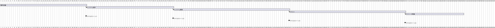

### プロジェクト計画書

---

#### プロジェクト計画書

**プロジェクト名:** こんこんプロジェクト  
**作成者:** [著者名、部署]  
**日付:** [日付を挿入]  
**バージョン:** 1.0  

---

#### 1. プロジェクト概要
**プロジェクト名:** こんこんプロジェクト  
**プロジェクト概要:**  
本プロジェクトは、イベント参加者が円滑にイベントに参加し楽しむためのシステムを開発します。具体的には、受付からイベントガイドの提供、写真撮影とアップロード、活動履歴の管理、特典の発行までのプロセスをシステム化します。

---

#### 2. 目標と成果物

**プロジェクト目標:**  
- 参加者の受付プロセスの自動化
- デジタルイベントガイドの提供
- 写真撮影と解析の自動化
- 活動履歴のリアルタイム管理
- デジタル特典の発行

**成果物:**  
- QRコードチェックインシステム
- デジタルイベントガイドシステム
- 写真撮影と解析システム
- 活動履歴管理システム
- デジタル特典発行システム

---

#### 3. スケジュール

**主要なマイルストーン:**  
- プロジェクト開始: 2024/01/01
- 要件定義完了: 2024/02/15
- システム設計完了: 2024/04/01
- システム開発完了: 2024/06/01
- テスト完了: 2024/08/01
- リリース: 2024/09/30

**プロジェクトスケジュール:**  

---

#### 4. 役割と責任

**プロジェクトチーム:**  
- プロジェクトマネージャー: プロジェクト全体の管理
- 開発チームリーダー: 技術的リーダーシップとコーディネーション
- UI/UXデザイナー: ユーザーインターフェースとユーザーエクスペリエンスの設計
- 開発者: システム開発
- テスター: システムテスト
- 運営スタッフ: イベント運営と参加者サポート

**関係者一覧:**  
- プロジェクトスポンサー
- 学校管理者
- 参加者

---

#### 5. リソース計画

**必要なリソース:**  
- 人的資源: 開発者、デザイナー、テスター、運営スタッフ
- 技術的リソース: 開発環境、テスト環境、クラウドインフラ（AWS）
- 予算: 開発コスト、運用コスト

---

#### 6. リスク管理

**リスク識別:**  
- 開発遅延
- 予算超過
- 技術的障害
- ユーザー不満

**リスク対応計画:**  
- 開発遅延: スケジュールの定期レビュー、進捗報告の強化
- 予算超過: コスト監視、優先度の高い機能への集中
- 技術的障害: 技術検証、バックアップ計画の準備
- ユーザー不満: ユーザーテスト、フィードバックの収集と反映

---

#### 7. コミュニケーション計画

**コミュニケーション手段:**  
- 定例会議: 週次ミーティング
- レポート: 週次進捗報告
- メール: 日常的なコミュニケーション

**報告の頻度と内容:**  
- 週次ミーティング: 進捗報告と課題共有
- 月次報告: プロジェクト全体のステータス報告

---

#### 8. 変更管理計画

**変更管理プロセス:**  
1. 変更要求の提出
2. 変更要求の評価
3. 変更要求の承認
4. 変更の実施
5. 変更履歴の更新

---
