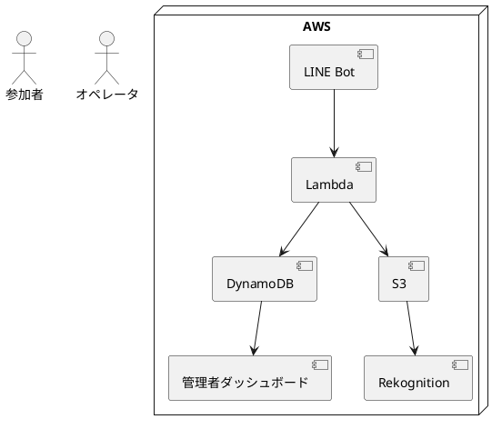
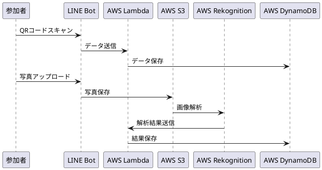
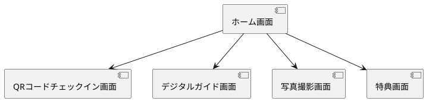
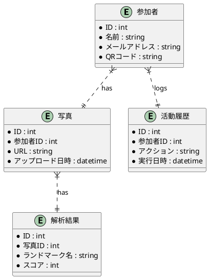

以下に基づいて「こんこんプロジェクト」の基本設計書を作成します。

# 基本設計書

**プロジェクトタイトル:** こんこんプロジェクト  
**作成者:** [著者名、部署]  
**作成日:** [日付を挿入]  
**バージョン:** 1.0

## 目次

1. 表紙
2. 目次
3. 概要
4. システム構成図
5. 機能設計
6. コンポーネント設計
7. システムアーキテクチャ設計
8. ユーザーインターフェース設計
9. 画面設計
10. 帳票設計
11. データベース設計
12. 外部インターフェース設計
13. バッチ処理設計
14. セキュリティ設計
15. 運用設計
16. 性能設計
17. 制約事項
18. その他

---

## 1. 表紙

**プロジェクトタイトル:** こんこんプロジェクト  
**作成者:** [著者名、部署]  
**作成日:** [日付を挿入]  
**バージョン:** 1.0

---

## 2. 目次

目次は上記の項目を含みます。

---

## 3. 概要

### システムの概要

「こんこんプロジェクト」では、イベント参加者が円滑にイベントに参加し、楽しむためのシステムを開発します。システムは以下の機能を含みます：
- 参加者の受付
- イベントガイドの提供
- ランドマークの探索
- 写真撮影とアップロード
- 活動履歴の管理
- 特典の発行

### 背景と目的

イベント運営の効率化と参加者の利便性向上を目的とし、デジタル技術を活用したシステムの導入を決定しました。これにより、運営コストの削減や参加者の満足度向上を目指します。

### 対象範囲

本プロジェクトは、学校キャンパス内で行われるオリエンテーションやオープンキャンパスなどのイベントを対象とします。

---

## 4. システム構成図

### ハードウェア構成

### ネットワーク構成

---

## 5. 機能設計

### 機能一覧

| 管理番号 | 機能                     | 説明                                                    | 分類       | 対応業務要件 |
|----------|--------------------------|---------------------------------------------------------|------------|--------------|
| FR-1     | QRコードチェックイン     | QRコードを使用して参加者が自動チェックインを行う機能     | フロント機能 | BR-1         |
| FR-2     | デジタルガイド提供       | デジタルイベントガイドをLINE Bot内で提供する機能        | フロント機能 | BR-2         |
| FR-3     | ランドマーク探索         | デジタルガイドに従ってランドマークを探索する機能        | UI         | BR-3         |
| FR-4     | 写真撮影とアップロード   | 参加者が撮影した写真をLINE Botを通じて自動でアップロードし、解析する機能 | バック機能 | BR-4         |
| FR-5     | 活動履歴のリアルタイム管理 | 参加者の活動履歴をリアルタイムで収集・管理する機能      | バック機能 | BR-5         |
| FR-6     | デジタル特典発行         | スコアに応じたデジタル特典を自動で発行し、参加者に配布する機能 | バック機能 | BR-6         |
| FR-7     | データ確認               | オペレータが参加者の活動履歴を確認する機能              | UI         | BR-5         |

### 各機能の詳細設計

#### FR-1: QRコードチェックイン

- **入力項目**: QRコード
- **出力項目**: チェックイン確認メッセージ
- **処理フロー**:
  1. 参加者がQRコードをスキャン
  2. LINE Botがチェックインを確認し、参加者にイベント情報を提供
  3. チェックインデータをAWS Lambdaを通じてDynamoDBに保存

#### FR-2: デジタルガイド提供

- **入力項目**: 参加者ID
- **出力項目**: デジタルイベントガイド
- **処理フロー**:
  1. 参加者がイベントガイドを要求
  2. LINE Botがデジタルガイドを提供

#### FR-3: ランドマーク探索

- **入力項目**: なし
- **出力項目**: ランドマーク情報
- **処理フロー**:
  1. 参加者がランドマーク情報を確認
  2. デジタルガイドに従ってランドマークを探索

#### FR-4: 写真撮影とアップロード

- **入力項目**: 写真
- **出力項目**: アップロード確認メッセージ
- **処理フロー**:
  1. 参加者が写真を撮影し、LINE Botを通じてアップロード
  2. 写真データがAWS S3に保存される
  3. AWS Rekognitionで写真解析
  4. 解析結果をDynamoDBに保存

#### FR-5: 活動履歴のリアルタイム管理

- **入力項目**: 活動データ
- **出力項目**: 活動履歴表示
- **処理フロー**:
  1. 活動データを収集
  2. データをリアルタイムでDynamoDBに保存
  3. オペレータが活動履歴を確認

#### FR-6: デジタル特典発行

- **入力項目**: スコア
- **出力項目**: デジタル特典
- **処理フロー**:
  1. 参加者のスコアに基づいて特典を発行
  2. デジタル特典を参加者に提供

#### FR-7: データ確認

- **入力項目**: 参加者ID
- **出力項目**: 活動履歴データ
- **処理フロー**:
  1. オペレータが参加者IDを入力
  2. DynamoDBから活動履歴データを取得し表示

---

## 6. コンポーネント設計

### コンポーネント一覧

| コンポーネント名          | 役割                              |
|--------------------------|----------------------------------|
| LINE Bot                | 参加者とのインターフェース         |
| AWS Lambda              | データ処理とビジネスロジック実行   |
| AWS S3                  | 写真データの保存                  |
| AWS Rekognition         | 写真データの解析                  |
| AWS DynamoDB            | データベース管理                  |
| 管理者ダッシュボード     | 活動履歴の表示と管理              |

### コンポーネントの役割と機能

#### LINE Bot
- **役割**: 参加者とのインターフェース
- **機能**: QRコードチェックイン、デジタルガイド提供、写真アップロード

#### AWS Lambda
- **役割**: データ処理とビジネスロジック実行
- **機

能**: データ保存、写真解析リクエスト、特典発行

#### AWS S3
- **役割**: 写真データの保存
- **機能**: 写真データの安全な保存とアクセス

#### AWS Rekognition
- **役割**: 写真データの解析
- **機能**: 画像解析と結果の提供

#### AWS DynamoDB
- **役割**: データベース管理
- **機能**: 参加者データ、写真データ、解析結果、活動履歴の保存

#### 管理者ダッシュボード
- **役割**: 活動履歴の表示と管理
- **機能**: リアルタイムデータ表示、特典管理

### コンポーネント間のインターフェース

#### データフロー

1. **QRコードチェックイン**
   - LINE Bot → AWS Lambda → AWS DynamoDB

2. **写真撮影とアップロード**
   - LINE Bot → AWS S3 → AWS Lambda → AWS Rekognition → AWS Lambda → AWS DynamoDB

3. **活動履歴管理**
   - LINE Bot → AWS Lambda → AWS DynamoDB → 管理者ダッシュボード

### 依存関係
- LINE BotはAWS Lambdaに依存
- AWS LambdaはAWS S3、Rekognition、DynamoDBに依存
- 管理者ダッシュボードはDynamoDBに依存

### 設計パターン
- **MVCパターン**: 管理者ダッシュボードに適用
- **マイクロサービスアーキテクチャ**: AWSサービスを利用した疎結合なシステム設計

---

## 7. システムアーキテクチャ設計

### アーキテクチャ概要

システムはAWSクラウドを基盤としたマイクロサービスアーキテクチャを採用し、高可用性とスケーラビリティを実現します。

### レイヤー構造

1. **プレゼンテーション層**: LINE Bot、管理者ダッシュボード
2. **ビジネスロジック層**: AWS Lambda
3. **データアクセス層**: AWS DynamoDB

### システム構成図

### 技術スタック
- **開発言語**: Python
- **フレームワーク**: Flask
- **クラウドインフラ**: AWS（S3, Rekognition, DynamoDB, Lambda）
- **外部インターフェース**: LINE Messaging API

### 非機能要件の対応
- **可用性**: AWSのマルチAZ構成を採用
- **性能**: 画像解析のレスポンスを2秒以内に抑える
- **セキュリティ**: HTTPS通信、AWS IAMによるアクセス制御

---

## 8. ユーザーインターフェース設計

### 画面一覧

| 画面ID | 画面名                     | 説明                              |
|--------|----------------------------|-----------------------------------|
| UI-1   | QRコードチェックイン画面   | QRコードをスキャンする画面        |
| UI-2   | デジタルガイド画面         | イベント情報を表示する画面        |
| UI-3   | 写真撮影画面               | 写真を撮影し、アップロードする画面|
| UI-4   | 特典画面                   | 取得した特典を表示する画面        |
| UI-5   | 管理者ダッシュボード       | 活動履歴を確認する画面            |

### 画面遷移図

### 画面レイアウト

#### QRコードチェックイン画面

- **ヘッダー**: システムロゴ、イベント名
- **メインコンテンツ**: QRコードスキャンエリア、スキャン結果表示
- **フッター**: ナビゲーションボタン（ホーム、ガイド、写真、特典）

### UI要素の定義
- **ボタン**: チェックインボタン、ガイド取得ボタン、写真撮影ボタン、特典確認ボタン
- **入力フィールド**: QRコード入力フィールド
- **ラベル**: イベント名、ユーザー名、スコア表示

### ユーザビリティ
- 直感的な操作が可能なレイアウト
- 視認性の高いデザイン
- モバイルフレンドリーなインターフェース

### スタイルガイド
- **カラースキーム**: イベントテーマカラー（例：青、白）
- **フォント**: 明朝体、ゴシック体
- **アイコン**: QRコードアイコン、カメラアイコン、特典アイコン

---

## 9. 画面設計

### 画面一覧

| 画面ID | 画面名                     | 説明                              |
|--------|----------------------------|-----------------------------------|
| UI-1   | QRコードチェックイン画面   | QRコードをスキャンする画面        |
| UI-2   | デジタルガイド画面         | イベント情報を表示する画面        |
| UI-3   | 写真撮影画面               | 写真を撮影し、アップロードする画面|
| UI-4   | 特典画面                   | 取得した特典を表示する画面        |
| UI-5   | 管理者ダッシュボード       | 活動履歴を確認する画面            |

### 各画面のレイアウト

#### QRコードチェックイン画面

- **ヘッダー**: システムロゴ、イベント名
- **メインコンテンツ**: QRコードスキャンエリア、スキャン結果表示
- **フッター**: ナビゲーションボタン（ホーム、ガイド、写真、特典）

### 画面項目の詳細仕様

| 項目名         | タイプ   | 説明                  |
|----------------|----------|-----------------------|
| QRコード入力   | テキスト | QRコードの入力フィールド|
| チェックインボタン | ボタン | チェックインを実行    |

---

## 10. 帳票設計

### 帳票一覧

| 帳票ID | 帳票名                 | 説明                                      |
|--------|------------------------|-------------------------------------------|
| RP-1   | チェックインリスト     | 参加者のチェックイン状況を一覧表示する帳票|
| RP-2   | 活動履歴レポート       | 参加者の活動履歴をまとめたレポート        |

### 各帳票のレイアウト

#### チェックインリスト

| 参加者ID | 名前       | チェックイン日時       |
|----------|------------|-----------------------|
| 1        | 山田太郎   | 2024-09-01 09:00:00   |
| 2        | 田中花子   | 2024-09-01 09:05:00   |

#### 活動履歴レポート

| 参加者ID | 名前       | 活動内容       | 実行日時            |
|----------|------------|----------------|---------------------|
| 1        | 山田太郎   | ランドマーク訪問| 2024-09-01 10:00:00 |
| 2        | 田中花子   | 写真撮影       | 2024-09-01 10:05:00 |

### 帳票項目の詳細仕様

| 項目名          | タイプ   | 説明                       |
|-----------------|----------|----------------------------|
| 参加者ID        | 整数     | 参加者の一意識別子        |
| 名前            | 文字列   | 参加者の名前              |
| チェックイン日時| 日時     | チェックインが行われた日時|

---

## 11. データベース設計

### データベース論理設計（

ER図）

### データベース物理設計

| テーブル名    | カラム名       | タイプ    | 説明                   |
|---------------|----------------|-----------|------------------------|
| 参加者        | ID             | INT       | 参加者の一意識別子     |
|               | 名前           | VARCHAR   | 参加者の名前           |
|               | メールアドレス | VARCHAR   | 参加者のメールアドレス |
|               | QRコード       | VARCHAR   | 参加者のQRコード       |
| 写真          | ID             | INT       | 写真の一意識別子       |
|               | 参加者ID       | INT       | 参加者のID（FK）       |
|               | URL            | VARCHAR   | 写真の保存URL          |
|               | アップロード日時| DATETIME  | 写真のアップロード日時 |
| 解析結果      | ID             | INT       | 解析結果の一意識別子   |
|               | 写真ID         | INT       | 写真のID（FK）         |
|               | ランドマーク名 | VARCHAR   | 認識されたランドマーク名|
|               | スコア         | INT       | 認識スコア             |
| 活動履歴      | ID             | INT       | 活動履歴の一意識別子   |
|               | 参加者ID       | INT       | 参加者のID（FK）       |
|               | アクション     | VARCHAR   | 実行されたアクション   |
|               | 実行日時       | DATETIME  | アクションの実行日時   |

---

## 12. 外部インターフェース設計

### 他システムとの連携仕様

| インターフェース名 | 説明                                  | 接続先               |
|--------------------|---------------------------------------|----------------------|
| LINE Messaging API | LINE Botとの通信インターフェース     | LINE                 |
| AWS S3             | 写真データの保存場所                 | AWS S3               |
| AWS Rekognition    | 写真データの解析を行うサービス       | AWS Rekognition      |
| AWS DynamoDB       | 解析結果や活動履歴データの保存場所   | AWS DynamoDB         |
| AWS Lambda         | イベント駆動型のバックエンド処理     | AWS Lambda           |

### データ交換フォーマット

| 項目名   | タイプ   | 説明                   |
|----------|----------|------------------------|
| QRコード | VARCHAR  | 参加者のQRコード      |
| 写真     | BLOB     | 参加者が撮影した写真  |
| 解析結果 | JSON     | AWS Rekognitionの解析結果|

### インターフェースの通信プロトコル
- **LINE Messaging API**: HTTPS
- **AWS S3**: HTTPS
- **AWS Rekognition**: HTTPS
- **AWS DynamoDB**: HTTPS
- **AWS Lambda**: HTTPS

---

## 13. バッチ処理設計

### バッチ処理の一覧

| バッチID | バッチ名               | 説明                          |
|----------|------------------------|-------------------------------|
| BT-1     | データバックアップ     | データベースの定期バックアップ|
| BT-2     | アクティビティ集計     | 活動履歴データの集計処理      |

### 各バッチ処理の詳細仕様

#### データバックアップ

- **バッチID**: BT-1
- **説明**: データベースの定期バックアップを行う
- **実行タイミング**: 毎日深夜1時
- **処理内容**: DynamoDBのデータをS3にエクスポート

#### アクティビティ集計

- **バッチID**: BT-2
- **説明**: 活動履歴データの集計処理
- **実行タイミング**: 毎日深夜2時
- **処理内容**: 当日の活動履歴を集計し、集計結果をDynamoDBに保存

---

## 14. セキュリティ設計

### 認証・認可の仕様

- **認証**: QRコードを使用したシングルサインオン
- **認可**: AWS IAMを利用したアクセス制御

### データ暗号化
- **データ保存時**: AWS KMSを使用して暗号化
- **データ通信時**: HTTPSを使用

### セキュリティポリシー
- **アクセス制御**: IAMポリシーによる厳格なアクセス管理
- **監査ログ**: CloudWatch Logsを使用してアクセスログを記録
- **定期監査**: 定期的なセキュリティ監査を実施

---

## 15. 運用設計

### システム運用手順

- **監視**: CloudWatchを使用してシステムパフォーマンスと稼働状況を監視
- **アラート**: 異常検知時にSMSおよびメールでアラート通知

### バックアップ・リカバリ手順
- **バックアップ**: 毎日深夜にDynamoDBのデータをS3にバックアップ
- **リカバリ**: 障害発生時にバックアップデータを使用して復旧

### 障害対応手順
- **検知**: CloudWatchアラームを設定
- **対応**: 障害発生時に即時対応チームが対応
- **報告**: 障害の詳細と対応状況をプロジェクトマネージャーに報告

---

## 16. 性能設計

### 性能要件
- **レスポンスタイム**: 画像解析結果を2秒以内に返す
- **スループット**: 同時に1000人以上のアクセスに対応

### 負荷試験の計画
- **目標**: システムが高負荷環境でも安定稼働することを確認
- **手法**: シミュレーションツールを使用した負荷試験
- **項目**: 同時アクセス数、レスポンスタイム、スループット

---

## 17. 制約事項

### システム開発上の制約
- **使用技術**: AWSを中心としたクラウドインフラ
- **開発言語**: Python

### 使用技術やツールの制限
- **クラウドサービス**: AWSのみを使用

---

## 18. その他

### テスト計画
- **ユニットテスト**: 各機能の単体テスト
- **統合テスト**: 複数機能の組み合わせテスト
- **システムテスト**: システム全体のテスト
- **ユーザビリティテスト**: ユーザーインターフェースの使いやすさを評価

### 保守計画
- **アップデート**: システムの定期的なアップデートとパッチ適用
- **ドキュメント**: 技術文書と運用ガイドの整備
- **サポート**: ユーザーからの問い合わせ対応とフィードバックの反映

### 移行計画
- **旧システムからの移行手順**: データ移行手順の策定
- **データ移行計画**: データの移行計画と手順を整備

以上が「こんこんプロジェクト」の基本設計書です。各項目に基づいてシステムの設計と開発を進めてください。
